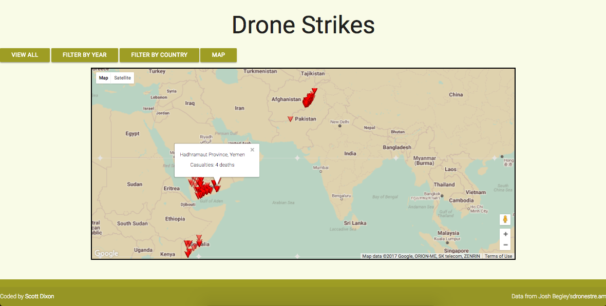
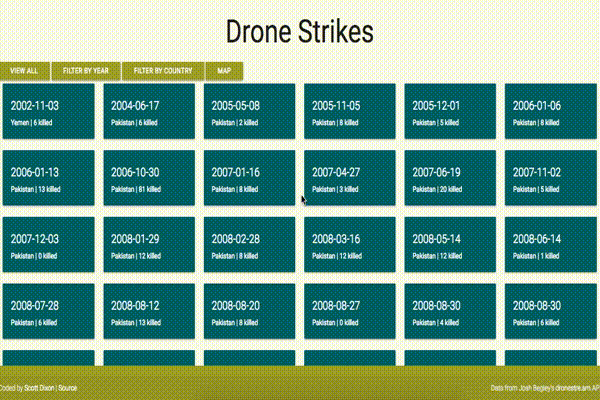

# Drone Strikes

Using the [dronestre.am API](http://dronestre.am/), visualizes data about drone strikes. Utilizes the Google Maps API to show drone strike locations on the map.

#### Screenshots:

Map view

Detail view
